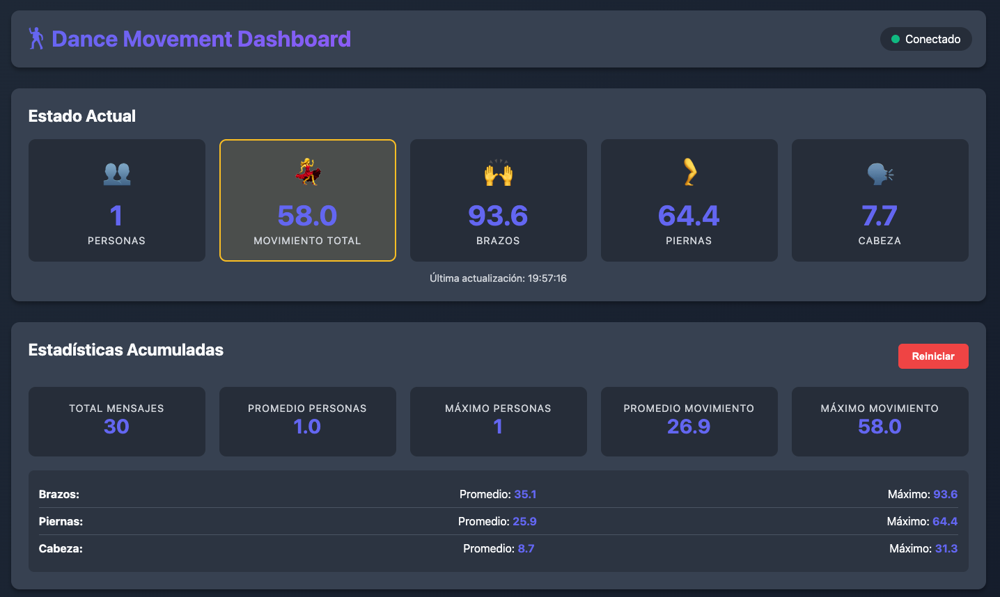
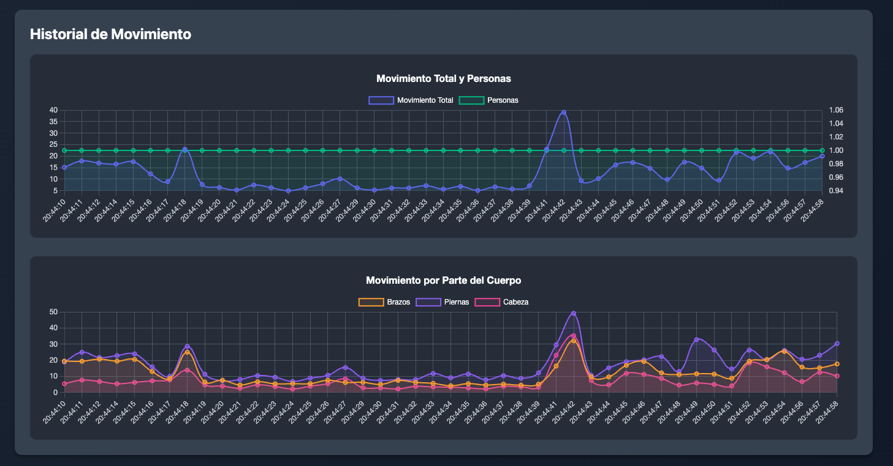

# Dance Movement Dashboard




Dashboard web en tiempo real para visualizar datos de movimiento de bailarines recibidos vía OSC desde el detector de movimiento.

## Características

- **Visualización en tiempo real** de datos de movimiento
- **Estadísticas actuales**:
  - Número de personas detectadas
  - Movimiento total, brazos, piernas y cabeza
- **Estadísticas acumuladas**:
  - Total de mensajes recibidos
  - Promedios de movimiento por parte del cuerpo
  - Valores máximos registrados
- **Gráficos históricos** con Chart.js
- **Actualización automática** vía WebSockets
- **Responsive design** para diferentes dispositivos

## Instalación

```bash
cd dance_dashboard
./start.sh
```

El script automáticamente:
1. Crea un entorno virtual
2. Instala todas las dependencias
3. Inicia el servidor

## Uso

### Modo básico
```bash
./start.sh
```

Luego abre tu navegador en: http://localhost:8080

### Cambiar puertos
```bash
# Escuchar OSC en puerto diferente
./start.sh --osc-port 7000

# Usar puerto web diferente
./start.sh --web-port 9090

# Ambos
./start.sh --osc-port 7000 --web-port 9090
```

### Ajustar historial
```bash
# Mantener 200 puntos de datos (default: 100)
./start.sh --history 200
```

## Uso con el Detector

1. **Iniciar el dashboard primero**:
```bash
cd dance_dashboard
./start.sh
```

2. **En otra terminal, iniciar el detector**:
```bash
cd ../dance_movement_detector
./start.sh
```

3. **Abrir el navegador** en http://localhost:8080

## Configuración

### Puertos por defecto
- **OSC**: 5005 (debe coincidir con el puerto de salida del detector)
- **Web**: 8080

### Conectar desde otro dispositivo

Si quieres ver el dashboard desde otro dispositivo en la misma red:

1. Encuentra tu IP local:
```bash
ifconfig | grep "inet " | grep -v 127.0.0.1
```

2. Accede desde otro dispositivo:
```
http://TU_IP:8080
```

Ejemplo: `http://192.168.1.100:8080`

## Funcionalidades del Dashboard

### Estado Actual
Muestra los valores más recientes recibidos:
- Número de personas bailando
- Movimiento total promedio
- Movimiento de brazos, piernas y cabeza

### Estadísticas Acumuladas
Calcula y muestra:
- Total de mensajes recibidos
- Total de personas detectadas acumuladas
- Promedios de movimiento
- Valores máximos alcanzados

### Botón Reiniciar
Limpia todas las estadísticas acumuladas y el historial.

### Gráficos
- **Gráfico 1**: Movimiento total y número de personas en el tiempo
- **Gráfico 2**: Movimiento por parte del cuerpo (brazos, piernas, cabeza)

Los gráficos muestran los últimos 50 puntos de datos para mejor legibilidad.

## Arquitectura

```
Cliente Web (navegador)
    ↑
    | WebSocket (Socket.IO)
    ↓
Servidor Flask
    ↑
    | OSC Messages
    ↓
Detector de Movimiento
```

## Mensajes OSC Recibidos

El dashboard espera estos mensajes OSC:

- `/dance/person_count` (int)
- `/dance/total_movement` (float)
- `/dance/arm_movement` (float)
- `/dance/leg_movement` (float)
- `/dance/head_movement` (float)

## Desarrollo

### Estructura de archivos
```
dance_dashboard/
├── src/
│   └── dashboard_server.py    # Servidor Flask + OSC
├── templates/
│   └── dashboard.html         # Template HTML
├── static/
│   ├── css/
│   │   └── dashboard.css      # Estilos
│   └── js/
│       └── dashboard.js       # Cliente WebSocket y Charts
├── requirements.txt
├── start.sh
└── README.md
```

### Dependencias principales
- Flask: Framework web
- Flask-SocketIO: WebSockets en tiempo real
- python-osc: Recepción de mensajes OSC
- Chart.js: Visualización de datos (CDN)

## Troubleshooting

### El dashboard no recibe datos
1. Verifica que el detector esté corriendo
2. Verifica que ambos usen el mismo puerto OSC (default: 5005)
3. Chequea la consola del servidor para mensajes de error

### El navegador no se conecta
1. Verifica que el puerto web no esté en uso
2. Intenta otro puerto: `./start.sh --web-port 9090`
3. Revisa el firewall

### Los gráficos no se actualizan
1. Abre la consola del navegador (F12) y busca errores
2. Verifica el indicador de conexión (debe estar verde)
3. Recarga la página

## API REST (opcional)

El dashboard también expone un endpoint REST:

```bash
curl http://localhost:8080/api/current
```

Devuelve JSON con los datos actuales, acumulados e historial.

## Tips para DJs

- Usa el botón "Reiniciar" al inicio de cada set
- Los valores de movimiento están en píxeles (10-150+ típico para baile)
- Puedes mostrar el dashboard en un monitor separado
- Los gráficos te ayudan a ver tendencias de energía en el baile
